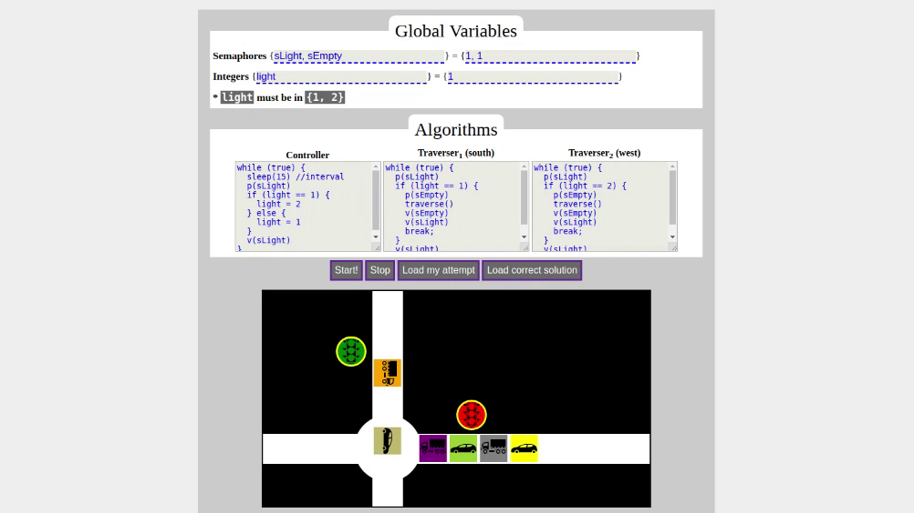

# softviz-semaphores
Promise-based traffic simulation.

Also check [softviz-philosophers](https://github.com/djalilhebal/softviz-philosophers) (similar idea, different problem, in Java)

To learn more or to try it, visit https://djalil.me/softviz-semaphores/ 

Still refactoring/updating an old [trashy side project of mine](https://djalil.me/trash/2019-12/dac-exo6/).
See the GitHub issues and [the TODO file](./TODO.md).

## What and Why
This web app is supposed be <em>useful</em> (as in \[2]) to students, so they can actually test their algorithms and see how they work in a dynamic system,
and not just a viz like I did with <a href="https://djalil.me/trash/2019-11/dac-exo3/?scenario=p1,p2,p3">DAC Exo3</a>.

Why? Why not. Also, because the idea of simulating a dynamic system sounded cool (my professor mentioned it).

It makes use of:
- JavaScript's <code>with</code> feature which is deprecated and highly discouraged
- <a href="https://developer.mozilla.org/en-US/docs/Web/JavaScript/Reference/Global_Objects/AsyncFunction">AsyncFunction</a>
- <a href="https://developer.mozilla.org/en-US/docs/Web/JavaScript/Reference/Global_Objects/Promise">Promise</a>
- SillySemaphore: My stupid Promise-based and queue-based semaphore
- Animated mainly using CSS `transition` and `transform: translate(..) rotate(..)`

## Technicalities
**Why not use ES modules?** \
Do not work on the `file://` protocol and I want this thing to work offline. Like, download as zip and open and run, just like that.

Developed and tested with <a href="https://brave.com/dre744">Brave Browser</a> v1.1 (Chromium v79.0).

Tested with Mozilla Firefox v76.0.

## References and Good Reads
These are some of the cool documents and topics I checked while making this...

- \[1]: Steve Carr and Jean Mayo and Ching-kuang Shene, <cite>ThreadMentor: A Pedagogical Tool for Multithreaded Programming</cite> (<a href="https://pages.mtu.edu/~shene/NSF-3/e-Book/index.html">tutorial</a>)

- \[2]: B. P. Miller, <cite>What to Draw? When to Draw? An Essay on Parallel Program Visualization</cite>

- Wikipedia, <i>Queueing theory</i>

- Wikipedia, <i>Taxicab geometry</i>

- Wikipedia, <i>Computer simulation</i>
- Wikipedia, <i>Web-based simulation</i>
- Wikipedia, <i>Discrete-event simulation</i>
- SIM.JS: <a href="https://en.wikipedia.org/wiki/SIM.JS">on Wikipedia</a>, <a href="http://simjs.com/index.html">its website</a>

- <a href="http://bit-player.org/2015/traffic-jams-in-javascript">Traffic Jams in Javascript | bit-player</a>

- <a href="https://www.ted.com/talks/wanis_kabbaj_what_a_driverless_world_could_look_like">Wanis Kabbaj: What a driverless world could look like | TED Talk</a>

## License
Abdeldjalil Hebal, CC BY 3.0
